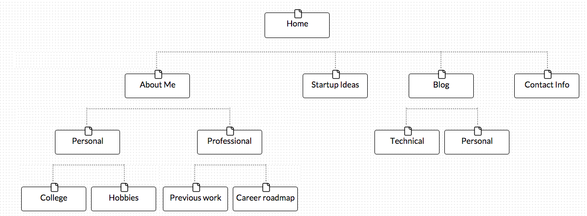

>What are the 6 Phases of Web Design?

1. Information Gathering 1
2. Planning 2
3. Design 3
4. Development 4
5. Testing & Delivery 5
6. Maintenance 6

>What is your site's primary goal or purpose? What kind of content will your site feature?

My site's main goal will be the display an about me page. Covering my past experiences, personal and professional, and will be geared towards people who wish to get to know me. It will effectively be my online resume for future employers, and also a way to connect and network with friends and family. I will cover my technical and personal blog, an about me section, contact information, and product ideas that I have.

>What is your target audience's interests and how do you see your site addressing them?

My target audience will be interested in getting to know me, and may have similar interests in terms of technology, my ideas, or hobbies that we may share.

>What is the primary "action" the user should take when coming to your site? Do you want them to search for information, contact you, or see your portfolio? It's ok to have several actions at once, or different actions for different kinds of visitors.

The primary action will be to contact me, view my blog, or check out my personal hobbies. I would hope they would be interested in seeing my previous experiences for future employment, or just to connect in terms of product ideas that they may find interesting that I have posted on my site.

>What are the main things someone should know about design and user experience?

Design and user experience are critical to web development and application development. It has been an emerging part of the internet and the way people are creating new things. Design can be broken down into a process in approaching the way things are created, viewed, and visualized. Design and user experience can be largely shaped by the problem you are trying to solve, the audience you are catering to, and what stage of prototyping the product or site may be at. It is an ongoing process - color, sizing, text, visual queues are only some things to consider and constantly change as information on the site or application may change.

>What is user experience design and why is it valuable?

User experience is focused on the way users interact with you product, web site, or application. From start to end, what is the package that is being offered and how is it presented. What are potential process flows through which a user can navigate or explore your site? User experience considers the presentation of information (visual, text, aural, etc.) With more kinds of media being presented across the internet, it is important to consider how they can be combined or packaged in the most efficient way that is user-friendly and intuitive for a new user to utilize. It is important as it effects the way the public views your site or application, and can have an impact on how much business or traffic may come your way.

>Which parts of the challenge did you find tedious?

Getting through the articles was a bit hard, but once I started reading it wasn't as bad as I thought it would be.