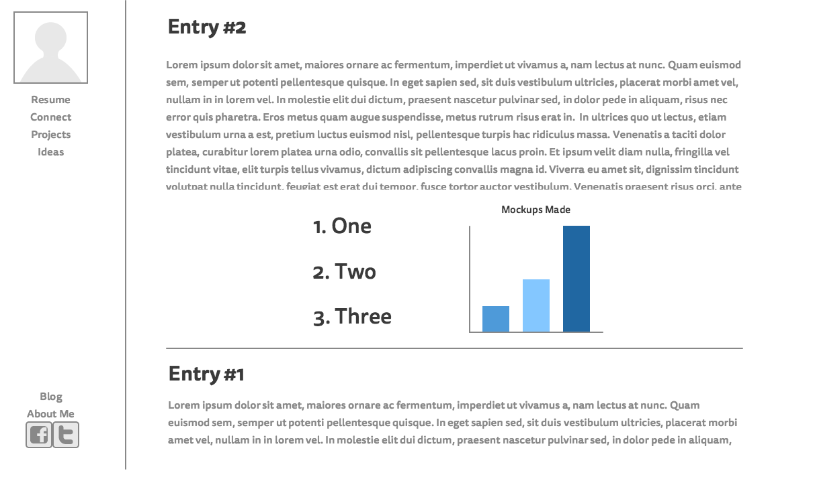

Home Page: This will effectively be a continous stream of all posts (including blogs)

Blog Page: This will filter only blog posts (technical and personal)

>What is a wireframe?
A wireframe is essentially the screen design of a web page, organizing the information, look, and feel of the page.

>What are the benefits of wireframing?
Wireframe serves an important step in the design process as it allows you to sketch and layout all the components you wish to have on a web page. It provides a blueprint to how to code the web page.

>Did you enjoy wireframing your site?
Normally I am not a very design focused person, but I had a great time finding inspiration and choosing to focus on a simple design. There are more tweaks to be made, but for now I am happy with my initial design.

>Did you revise your wireframe or stick with your first idea?
Yes, It was easy to stick with the normal footer and header, but I felt that they were not needed (unless required for a future challenge I can add them in). The side bar was a change that I chose after looking at blog sites online and having it as a permanent fixture for easy navigation no matter how far into an article you have read.

>What questions did you ask during this challenge? What resources did you find to help you answer them?
I wanted to know how blogs were formatted or designed, so I did some research online. This took some time as I was looking for a simple and clean structure with minimal linking and content strucutre. I wanted to find the answer to the question, what is the simplest and most effective blog format out there. Of course this was a personal choice of what I thought worked best for me.

>Which parts of the challenge did you enjoy and which parts did you find tedious?
I found the design part of the challenge very rewarding and exciting. I can see how this is a such a emerging part of web design, but also how it can be frustrating as it is largely subjective to the client and what they deem attractive to the eyes.