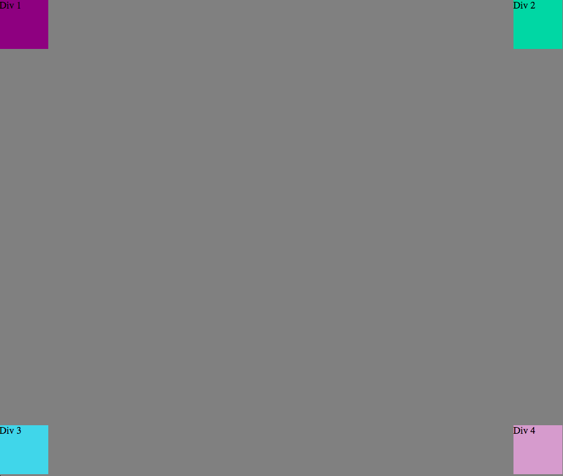

>How can you use Chrome's DevTools inspector to help you format or position elements?

Chrome's DevTools inspector are very useful in making inline changes and seeing the immediate effects on the web page. This allows for more iterations of trying different styles and getting back immediate feedback without altering your original source code.

>How can you resize elements on the DOM using CSS?

There are many different ways to resize elements on the DOM. You can change the pixel size, em size, or percentage of different heights, widths, borders, paddings, etc.

>What are the differences between Absolute, Fixed, Static, and Relative positioning? Which did you find easiest to use? Which was most difficult?

Static elements are not affected by top, bottom, left, or right properties. Relative positioning is relative to its normal position. Fixed is positioned relative to its viewpoint, which means it will always stay in the same place regardless of where you move the page, and absolute is positioned relative to its nearest ancestor or the overall document. I found absolute the easiest to use when trying to establish a footer. Relative to me seems to be the hardest but I have yet to use it.

>What are the differences between Margin, Border, and Padding?

Padding clears an area around the content which is transparent,the border goes around the padding and content, and the margin clears an area around the border which is transparent.

>What was your impression of this challenge overall? (love, hate, and why?)

Loved this challenge. I had the opportunity to work with another great pair, and I was able to see the utility in getting back immediate feedback in design changes. Also, it was a great way to practice different positioning and coloring using CSS.